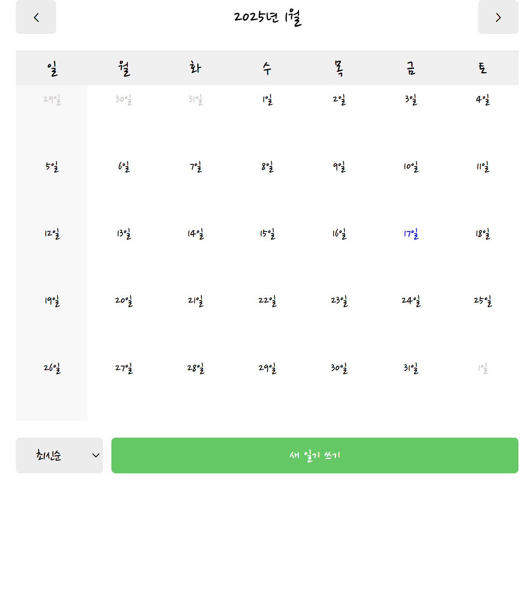
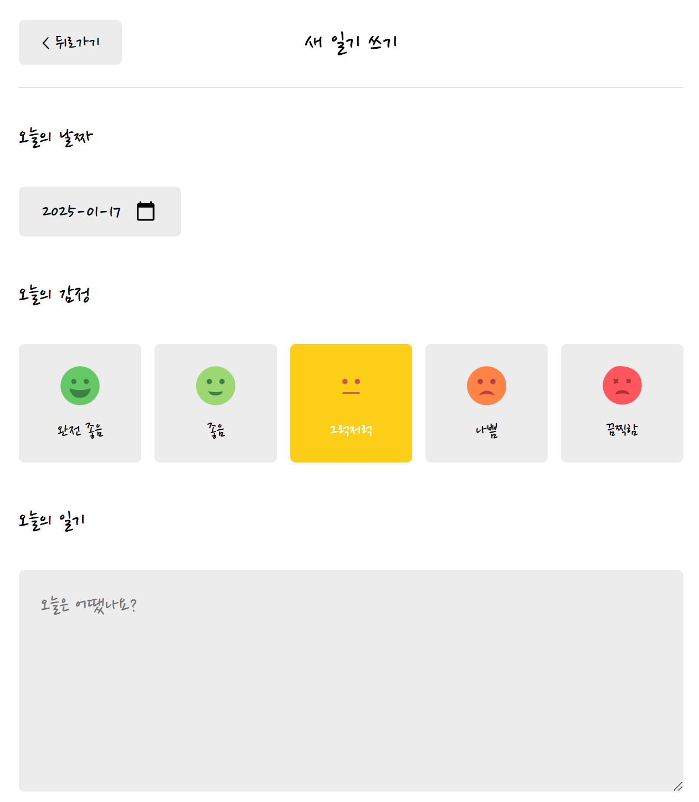
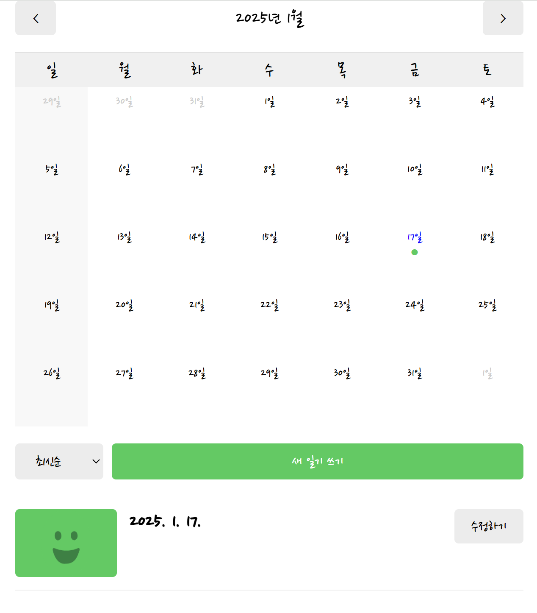

# 1주차 개인 평가

### 목차

| No  |                        구분                        |
| :-: | :------------------------------------------------ |
|  1  | [기획 아이디어](#기획-아이디어)                    |
| 1-1 | [브레인 스토밍 과정에서 제안한 아이디어](#브레인-스토밍-과정에서-제안한-아이디어) |
|     | [1. 환경 교육 및 자원 재활용 플랫폼](#환경-교육-및-자원-재활용-플랫폼) |
|     | [2. 금융 교육 플랫폼](#금융-교육-플랫폼)            |
|     | [3. 부동산 투어 & 계약 플랫폼](#부동산-투어-계약-플랫폼) |
|     | [4. 육아 상담 및 육아 물품 중고 거래 플랫폼](#육아-상담-및-육아-물품-중고-거래-플랫폼) |
|     | [5. 친구들이랑 만나서 뭐할지 계획세우는 플랫폼](#친구들이랑-만나서-뭐할지-계획세우는-플랫폼) |
|     | [6. 유기견 가족 찾아주기 플랫폼](#유기견-가족-찾아주기-플랫폼) |
| 1-2 | [최종 선정 아이디어 구체화 과정에서 제안한 아이디어](#최종-선정-아이디어-구체화-과정에서-제안한-아이디어) |
|  2  | [학습 내용](#학습-내용)                           |

##  1. 기획 아이디어

> 내가 제안한 기획 아이디어 기록

###  1-1. 브레인 스토밍 과정에서 제안한 아이디어

####  1. 환경 교육 및 자원 재활용 플랫폼

   **배경**

   - **환경 문제의 심각성**: 기후 변화와 자원 고갈 문제가 심화됨에 따라 환경 보호의 필요성이 커지고 있음.
   - **교육과 실천의 연계 부족**: 환경 보호에 대한 교육은 많지만, 실제 재활용 실천으로 이어지지 않는 경우가 많음.
   - 환경 보호에 대한 인식, 재활용을 해야 한다는 것과 이를 실천해야 한다는 마음은 있지만 이에 대해 정확하게 잘 모르는 경우가 있음.

     [참고기사_잘못된 상식 버려야 산다…분리배출 방법](https://www.seoul.co.kr/news/newsView.php?id=20210129025003)
   - **단체 기반 협력 활동의 필요성 :** 지역 주민, 학교, 회사와 같은 단체 기반 활동은 환경 문제 해결에 효과적이지만, 이러한 활동을 체계적으로 기록하고 공유할 플랫폼이 부재하다.
    
      - **근거**: 환경 NGO, 학교 환경 동아리, 기업의 ESG 캠페인 사례에서 단체 협력이 개인 활동보다 높은 지속 가능성과 실질적 효과를 보여줌.
      - UNEP(2022년): 환경 캠페인의 약 60%가 비체계적으로 기록되고 있어 통합 플랫폼의 필요성이 제기됨.

   **목표**

   - **가상 마을 꾸미기**를 통해 재미와 몰입감을 제공하며, 사용자들이 자연스럽게 환경 실천에 참여하도록 유도.
   - 환경 교육과 이와 연결된 퀘스트를 통해 사용자의 인식을 개선하고, 학습한 내용을 실천으로 연결.
   - 지역, 학교, 회사 단위의 협력 활동을 통해 환경 문제 해결과 지속 가능한 실천을 지원.

   **주요 컨셉**

   - **학습과 실천의 연결**: 환경 교육과 자원 재활용 활동을 하나의 플랫폼에서 통합.
   - **단체 기반 협력**: 지역 주민, 학교, 회사가 함께 참여하고, 데이터를 통해 실천 결과를 공유하며 협력.
   - **게임화 요소 도입**: 재미와 동기를 부여하는 챌린지 및 보상 시스템. 재활용 실천을 통해 포인트를 얻고, 포인트로 가상 마을을 꾸미는 게임화된 경험 제공.

   **주기능**

   - **가상 마을 꾸미기**
     - 재활용 챌린지: 재활용 실천 인증(사진/영상 업로드)을 통해 포인트 획득.
     - 획득한 포인트로 마을에 나무 심기, 건물 업그레이드, 친환경 아이템 추가.
     - 마을의 환경 상태를 시각적으로 표시(예: 탄소 배출 감소, 재활용률 상승).
   - **단체 기반 활동**
     - 지역, 학교, 회사 등 단체별로 팀을 구성해 마을 꾸미기 대항전.
     - 팀 성과 데이터를 기반으로 랭킹 제공 및 보상 제공.
   - **데이터 시각화**

     - 개인 및 단체별 재활용 실천 데이터를 차트, 캘린더로 표시.
     - 마을 발전 상황을 데이터로 시각화(예: "이번 달 재활용을 통해 XXkg의 플라스틱 절감").

   - **환경 교육**
     - 실시간 화상 강의(WebRTC) 제공.예: 플라스틱 문제, 분리수거 방법 등.
     - 퀴즈와 챌린지를 통한 참여형 학습.
     - 마을 꾸미기 보상 제공 (혹은 가상 마을 퀘스트로 환경 교육 콘텐츠를 학습(예: 분리수거 방법, 기후 변화 원인).)

   **확장성(활용 방안)**

   - **AI 기반 분리수거 가이드**
     - 사용자가 업로드한 쓰레기 사진을 분석하여 적합한 분리수거 방법 추천.
   - **성과 보고서 자동 생성**
     - 개인 또는 단체의 환경 실천 데이터를 기반으로 PDF 리포트 자동 생성.

   **기대효과**

   - **환경 인식 개선**
     - 재미와 실천을 결합하여 사용자가 환경 보호를 재미있게 실천하며 지속적으로 참여하고, 사용자들에게 환경 보호의 중요성을 체감하게 함.
   - **단체 활동으로 시너지 효과, 단체 협력을 통한 사회적 기여**
     - 학교, 회사, 지역 단위의 협력과 경쟁을 통해 환경 보호 효과 극대화.
     - 학교, 회사, 지역 단체가 협력하여 ESG 경영, 환경 교육, 지역사회 공헌에 활용.
   - **데이터 기반 환경 분석**
     - 사용자 활동 데이터를 분석하여 지역별·단체별 환경 실천 현황을 한눈에 파악.
   - **ESG 및 교육 효과 강화**
     - 기업의 ESG 경영, 학교의 환경 교육 프로그램에 활용 가능.

   **위험 요소와 해결 방안**

   - **초기 사용자 확보의 어려움**
     - **해결 방안**
       - 환경 단체, 학교, 기업과의 협력을 통해 초기 사용자 모집.
         - 예: 환경 동아리, CSR 활동과 연계한 시범 프로젝트 진행.
       - SNS 마케팅을 통해 사용자 경험을 공유하도록 유도.
   - **참여율 저하**
     - **해결 방안**
       - 재미 요소 강화: 게임화 요소 강화(꾸미기 아이템 추가, 랭킹 경쟁).
       - 지속적인 챌린지 및 보상 제공.
       - 새로운 퀘스트와 시즌별 이벤트 도입.
       - 단체 간 경쟁 및 협력을 유도하여 참여 동기 부여.
   - **가상 마을 구현의 기술적 복잡성**
     - **해결 방안**: 초기에는 간단한 2D 마을에서 시작하고, 단계적으로 3D로 확장.
   - **AI 분리수거 가이드의 낮은 정확도**
     - **해결 방안**: 초기에는 간단한 규칙 기반 시스템을 도입하고, 사용자 피드백과 데이터를 활용해 정확도를 점진적으로 개선.
   - **데이터 관리 및 보안 문제**
     - **해결 방안**: 데이터 암호화(TLS, AES) 및 사용자 동의 기반 데이터 처리.

  ---

####  2. 금융 교육 플랫폼

  **배경**

  - **문제점**: 금융 지식은 실생활에 꼭 필요한 기초 소양이지만, 아이들을 대상으로 한 교육 기회는 부족함. 학교 교육에서는 금융의 개념이나 실제 활용법을 체험할 기회가 제한적임.
  - **필요성**: 어린 시절부터 금융 개념과 실생활에서의 응용 능력을 키우면 성인이 된 후 합리적인 경제생활을 할 가능성이 높아짐.
  - **기술적 배경**: 기존 금융 교육 플랫폼과 차별화된 WebRTC 기술을 활용해 실시간 상호작용과 실감 나는 금융 체험 제공.

  **목표**

  - 아이들이 금융 지식을 재미있고 효과적으로 배우도록 돕는 **참여형 금융 교육 플랫폼** 개발.
  - 학교와 가정에서 모두 사용할 수 있는 **다목적 교육 환경** 구축.
  - 실생활 금융 활동을 시뮬레이션하는 기능을 통해 금융의 중요성과 효용성을 쉽게 이해할 수 있도록 지원.

  **주요 컨셉**

  - **참여형 학습**: 재미 요소를 결합한 금융 교육으로 학습의 몰입도와 지속성을 높임.
  - **실생활 시뮬레이션**: 통장 개설, 대출 신청 등 실생활 금융 활동을 체험.
  - **교육과 관리의 통합**: 학습 과정과 학습 효과를 데이터 기반으로 관리 및 분석.

  **주기능**

  - **학습 콘텐츠**:
    - **카드 뉴스**: 저축, 투자, 대출 등 금융 개념을 간단히 설명하는 콘텐츠 제공.
    - **퀴즈 게임**: 금융 개념을 재미있게 익힐 수 있는 퀴즈 진행.
      - **동시접속 기능**: 여러 학생이 실시간으로 참여 가능.
      - 점수 체계: 빠른 정답자에게 더 많은 점수를 부여.
    - **스코어보드**: 실시간 순위 제공 및 경쟁 요소 추가.

  - **모의 은행 시뮬레이션**:
    - **은행 방문 예약 및 상담**: WebRTC 기반 화상 기능을 통해 선생님이나 부모님이 은행원 역할을 수행.
    - **계약 체험**: 통장 개설, 대출 신청 등 서류를 동시 접속으로 작성하며 실습.

  - **교육 관리자 기능**:
    - 퀴즈 생성, 금융 상담 진행, 학습 진행도 모니터링 가능.
    - 데이터 분석을 통해 학습 효과 및 개선점 피드백 제공.

  **확장성(활용 방안)**

  - **다른 연령층 확대**: 고등학생, 대학생 등 성인을 대상으로도 확장 가능.
  - **금융기관 연계**:
    - 은행과 협력하여 **실제 금융 상품** 체험 가능(저축 통장, 소액 투자 등).
    - 협업을 통한 **금융 인증 프로그램** 제공.
  - **다문화 교육**: 외국어 지원으로 다양한 국가의 어린이 대상 금융 교육 가능.
  - **모바일 앱 개발**: 플랫폼 접근성을 높여 스마트폰, 태블릿에서도 사용 가능.

  **기대효과**

  - **아이들에게 실생활 금융 개념 내재화**: 학습된 금융 지식을 성인이 되어 실질적으로 활용 가능.
  - **학부모와 교육기관 만족도 향상**: 재미있고 실용적인 학습 경험 제공.
  - **금융 이해도 제고**: 어린 나이에 금융에 대한 긍정적인 경험과 태도를 형성.
  - **사회적 효과**: 금융 문맹률 감소로 전반적인 경제적 사고 능력 증대.

  **위험 요소와 해결 방안**

  - **기술적 문제**:
    - **위험요소**: WebRTC 기술 사용 시 네트워크 연결 불안정이나 동기화 문제 발생 가능.
    - **해결 방안**: 네트워크 상태에 따른 유동적 품질 조정 및 사전 캐싱 기술 적용.

  - **사용자 데이터 보안**:
    - **위험요소**: 아이들의 개인정보 및 학습 데이터 유출 가능성.
    - **해결 방안**: 강력한 데이터 암호화 및 플랫폼 보안 인증 도입.

  - **플랫폼 복잡성**:
    - **위험요소**: 과도한 기능으로 사용자가 혼란을 느낄 가능성.
    - **해결 방안**: 사용자가 쉽게 이해할 수 있는 직관적 UI/UX 설계.

  - **컨텐츠 부족**:
    - **위험요소**: 초기 콘텐츠 부족으로 사용자 이탈 가능성.
    - **해결 방안**: 금융기관, 교육 전문가와 협력해 지속적으로 콘텐츠 업데이트.

  - **동시접속 문제**:
    - **위험요소**: 대규모 사용자 접속 시 서버 과부하.
    - **해결 방안**: 클라우드 기반 인프라와 부하 분산 시스템 적용.

---

####  3. 부동산 투어 & 계약 플랫폼

  **배경**

  - **문제점**: 기존 부동산 매물 탐색 및 상담은 오프라인에 크게 의존하며, 방문 및 상담 절차가 번거롭고 시간 소모가 큼.
  - **필요성**: 시간과 비용을 절약하고, 효율적인 온라인 상담 및 계약 체결 프로세스를 통해 부동산 거래 경험을 간소화할 필요가 있음.
  - **기술적 배경**: WebRTC 및 실시간 데이터 동기화 기술을 활용하면 원격으로도 실시간 상담과 계약 진행이 가능.

  **목표**

  - 부동산 매물 상담부터 계약까지 **원스톱으로 처리**할 수 있는 실시간 플랫폼 개발.
  - 임차인, 중개사, 집주인이 실시간으로 소통하며 **투명하고 효율적인 거래 환경** 제공.
  - 물리적 방문 없이 매물 정보를 상세히 확인하고, 필요한 경우 방문 일정도 플랫폼에서 손쉽게 조율.

  **주요 컨셉**

  - **실시간 연결**: 매물 정보, 상담, 계약을 실시간으로 처리하여 효율성과 편리성 극대화.
  - **사용자 맞춤 경험**: 사용자의 위치, 요구 조건에 따라 매물을 추천하고 일정을 조율.
  - **안전한 계약 프로세스**: 전자 서명과 계약 추적 기능으로 신뢰도 확보.

  **주기능**

  - **매물 탐색 및 상담**:
    - **매물 검색 기능**: 원하는 조건(가격, 위치, 면적 등)을 입력해 매물 추천.
    - **실시간 상담 기능**: WebRTC 기반 화상 상담으로 중개사와 소통하며 매물 정보 확인.
    - **매물 비교 및 공유**: 관심 매물을 저장하고, 가족이나 지인과 링크로 공유.

  - **실시간 매물 투어**:
    - **화상 투어**: 중개사 또는 집주인이 실시간으로 매물 내부를 보여주며 설명.
    - **VR 기반 투어**: 가상현실 기술을 활용해 임차인이 매물 내부를 자유롭게 탐험.
    - **질문/응답 실시간 처리**: 매물 투어 중 실시간 질문 및 응답 제공.

  - **매물 방문 스케줄링**:
    - **일정 조율 기능**: 중개사, 집주인, 임차인 간 방문 가능한 시간대 실시간 확인 및 예약.
    - **알림 시스템**: 방문 일정 알림 및 변경 사항 실시간 업데이트.

  - **계약 체결**:
    - **동시 접속 계약 시스템**: 집주인, 중개사, 임차인이 동시에 접속해 계약서 작성.
    - **전자 서명 및 문서 보관**: 계약서에 전자 서명하고 플랫폼 내 안전하게 저장.
    - **계약 진행 추적**: 계약 단계(작성, 확인, 서명 등)별 진행 상태를 실시간으로 확인.

  **확장성(활용 방안)**

  - **거래 외 서비스 연계**:
    - 인테리어 업체, 이사 서비스, 관리비 조회 등 추가 서비스 연결.
  - **다국어 지원**: 외국인 거주자를 위한 다국어 상담 및 계약 기능 추가.
  - **데이터 분석**: 사용자 선호도를 기반으로 맞춤 매물 추천 알고리즘 강화.
  - **모바일 앱 개발**: 스마트폰과 태블릿에서도 편리하게 플랫폼 이용 가능.

  **기대효과**

  - **시간과 비용 절감**: 방문하지 않고도 초기 상담과 투어 진행 가능.
  - **거래 투명성 향상**: 실시간 상담 및 계약 과정을 통해 신뢰도 증가.
  - **고객 편의성 증대**: 사용자 맞춤형 매물 검색과 간편한 계약 체결 제공.
  - **시장 경쟁력 강화**: 기존 부동산 플랫폼 대비 차별화된 고객 경험 제공.

  **위험 요소와 해결 방안**

  - **기술적 문제**:
    - **위험요소**: 실시간 화상 연결(WebRTC)에서 품질 저하 및 지연 가능성.
    - **해결 방안**: 네트워크 상태를 기반으로 화질 자동 조정 및 안정화 기술 적용.

  - **보안 문제**:
    - **위험요소**: 계약 과정에서 민감한 개인정보 및 금융 정보 유출 가능성.
    - **해결 방안**: 데이터 암호화 및 보안 인증 프로토콜(Secure Sockets Layer) 적용.

  - **플랫폼 복잡성**:
    - **위험요소**: 사용자가 모든 기능을 이해하기 어려움.
    - **해결 방안**: 사용자 친화적 UI/UX 설계 및 가이드 제공.

  - **참여자 동기 부족**:
    - **위험요소**: 집주인 또는 중개사의 플랫폼 사용률 저조.
    - **해결 방안**: 초기 도입을 유도하기 위해 혜택(수수료 할인, 홍보 지원 등) 제공.

  - **법적 문제**:
    - **위험요소**: 전자 계약 및 전자 서명 법적 효력 논란.
    - **해결 방안**: 지역별 법적 기준에 부합하는 계약서 양식과 프로세스 설계.

---

####  4. 육아 상담 및 육아 물품 중고 거래 플랫폼

  **배경**

  - **문제점**: 아이들이 금방 자라면서 육아 용품의 사용 기간이 짧아 중고 거래가 빈번하지만, 물품의 상태를 확인하기 어려운 경우가 많음. 
  - **필요성**: 육아 과정에서 필요한 물품 거래, 상담, 정보 공유를 한곳에서 해결할 수 있는 플랫폼의 필요성 증대.
  - **기술적 배경**: WebRTC, 클라우드 데이터 저장소, 실시간 채팅/화상 기술 등을 활용해 부모 간의 상호작용 및 전문가 상담 강화.

  **목표**

  - **올인원 육아 플랫폼** 구축: 중고 거래, 상담, 기록, 커뮤니티 기능을 통합해 육아 부담 경감.
  - **육아 물품 신뢰도 향상**: 실시간 화상 기술로 물품 상태를 확인할 수 있는 안전한 거래 환경 제공.
  - **효율적인 소통 채널 구축**: 부모, 전문가, 어린이집 간의 정보 공유를 간편화.

  **주요 컨셉**

  - **안전한 거래 환경**: 화상 연결과 신뢰도 평가로 중고 거래의 신뢰성 향상.
  - **통합된 육아 기록**: 아이의 성장, 건강 이슈 등을 기록하고 어린이집/유치원과 공유.
  - **커뮤니티 활성화**: 부모 간 정보 교류와 유대감을 형성하는 온라인 소통 공간 제공.

  **주기능**

  - **중고 거래**:
    - **물품 등록**: 육아 용품을 판매 등록하며 사진과 세부 정보를 업로드.
    - **실시간 상태 확인**: WebRTC 기반 화상 연결로 구매자가 물품 상태를 실시간 확인.
    - **신뢰도 평가**: 거래 후 판매자/구매자의 신뢰도를 평가하여 안전한 거래 문화 조성.

  - **육아 상담**:
    - **전문가 매칭**: 육아 전문가(상담사, 소아과 의사 등)와 실시간 상담 연결.
    - **상담 유형 선택**: 수면 교육, 영양 관리, 행동 지도 등 상담 주제 선택 가능.
    - **기록 저장**: 상담 내용을 기록해 이후에도 참조할 수 있도록 지원.

  - **육아 기록 및 공유**:
    - **육아 다이어리**: 아이의 성장과 상태(체온, 식사, 수면 등)를 기록하고 시각적으로 확인.
    - **이슈 공유**: 열, 감기 등의 건강 문제를 간편하게 어린이집/유치원 선생님과 공유.
    - **알림 기능**: 어린이집 행사(크리스마스, 체험학습 등) 준비물 리스트와 일정 관리.

  - **커뮤니티**:
    - **랜선 모임**: WebRTC를 활용해 부모들끼리 온라인에서 근황을 공유하고 정보 교류.
    - **주제별 소모임**: 육아 방법, 놀이 추천, 지역별 중고 거래 등 특정 주제로 소모임 생성.
    - **Q&A 게시판**: 육아와 관련된 질문과 답변을 실시간으로 주고받을 수 있는 공간 제공.

  **확장성(활용 방안)**

  - **전문가 네트워크 강화**: 소아과 의사, 심리 상담사 등 전문가를 플랫폼에 지속적으로 유입.
  - **다문화 지원**: 외국인을 대상으로 다국어 상담 및 거래 기능 제공.
  - **이벤트/프로모션**: 육아용품 브랜드와 협력해 할인 및 체험 이벤트 진행.
  - **모바일 앱 지원**: 스마트폰에서 손쉽게 접근할 수 있는 앱 버전 제공.

  **기대효과**

  - **육아 부담 완화**: 부모들이 필요한 정보를 한 플랫폼에서 얻고, 시간과 비용을 절약.
  - **안전한 거래 환경 조성**: 실시간 상태 확인 및 신뢰도 평가로 중고 거래의 안전성 증가.
  - **효율적 정보 관리**: 어린이집/유치원과의 소통과 관리가 간편해지고 체계화.
  - **사회적 연결 강화**: 육아 중 고립감을 느끼는 부모들이 커뮤니티를 통해 유대감 형성.

  **위험 요소와 해결 방안**

  - **기술적 문제**:
    - **위험요소**: 실시간 화상 연결(WebRTC) 품질 저하 가능성.
    - **해결 방안**: 네트워크 상태에 따른 화질 조정 및 안정화 기술 적용.

  - **개인정보 보안**:
    - **위험요소**: 거래, 상담 기록 등 민감한 정보 유출 가능성.
    - **해결 방안**: 데이터 암호화와 인증 시스템 구축.

  - **참여자 부족**:
    - **위험요소**: 초기 사용자 확보 어려움.
    - **해결 방안**: 플랫폼 초기 도입 유도를 위한 할인 혜택 및 프로모션 제공.

  - **플랫폼 복잡성**:
    - **위험요소**: 다양한 기능으로 사용자가 혼란을 느낄 가능성.
    - **해결 방안**: 직관적 UI/UX 설계 및 사용 가이드 제공.

  - **법적 문제**:
    - **위험요소**: 중고 거래 및 상담 시 법적 분쟁 가능성.
    - **해결 방안**: 거래 및 상담 관련 법적 책임을 명확히 하는 이용약관 및 정책 마련.

---

####  5. 친구들이랑 만나서 뭐할지 계획세우는 플랫폼

  **배경**

  - **문제점**: 친구들과 모임을 계획할 때, 지도 앱, 메신저, 맛집 검색 등 다양한 앱을 왔다 갔다 하며 번거로움이 발생.
  - **필요성**: 모임 계획과 관련된 모든 과정을 한 플랫폼에서 처리하여 편의성을 높이고, 모임 전후의 추억도 체계적으로 관리할 필요성 증가.
  - **기술적 배경**: 지도 API, 성향 분석 알고리즘, WebRTC, 클라우드 데이터 저장 등 다양한 기술을 활용해 사용자 경험 향상 가능.

  **목표**

  - 모임 계획부터 실행, 추억 관리까지 **올인원 서비스** 제공.
  - 친구들의 일정, 위치, 성향을 고려한 **맞춤 장소 추천**과 모임 일정 조율.
  - 오프라인과 온라인 모임 모두 지원하여 **모임의 접근성**을 확대.

  **주요 컨셉**

  - **맞춤형 추천**: 성향과 위치를 고려한 최적의 만남 장소 추천.
  - **통합된 일정 관리**: 모임 일정 조율 및 이동 루트 시각화를 통해 효율적 계획 지원.
  - **모임 추억 관리**: 모임의 즐거운 순간을 기록하고 공유할 수 있는 공간 제공.

  **주기능**

  - **모임 계획**:
    - **지역 추천**:
      - 각 친구의 지역 입력 시 가장 적합한 만남 지역 자동 추천.
      - **성향 기반 추천**: 개인과 모임의 선호도를 분석해 맛집, 카페, 놀거리 추천.
    - **지도 및 리스트 뷰**: 검색한 지역의 맛집, 카페, 놀거리 등을 지도와 리스트로 확인.
    - **장소 상세 정보 및 예약**: 선택한 가게의 상세 정보를 확인하고 예약 가능.
    - **사장님 상담 기능**: 필요한 경우 실시간 상담(WebRTC 기반)으로 메뉴 추천, 예약 변경 등 진행.

  - **일정 조율**:
    - **가능 시간 계산**: 각 친구가 입력한 가능/불가능 시간을 기반으로 모두가 가능한 일정과 시간을 계산.
    - **모임 일정 관리**: 확정된 일정을 바탕으로 장소를 시간 순서대로 정리하고 이동 루트 시각화.

  - **채팅 및 화상 기능**:
    - **모임 채팅**: 모임별 채팅 서비스 제공.
    - **화상 모임**: WebRTC 기반 화상 통화 기능, 재미있는 필터 효과 및 사진 촬영 기능 제공.

  - **모임 추억 관리**:
    - **오늘의 모임 정리**:
      - 방문한 장소와 보낸 시간을 기록하고 사진을 업로드 및 공유.
      - 방문 후기 작성 기능, 작성된 후기는 사장님에게도 피드백 제공.
    - **추억상자**:
      - 모임별 다이어리 작성 및 저장, 추억을 간직할 수 있는 공간.
    - **정산 서비스**:
      - 총비용 계산 및 개인별 금액 분배 기능.
      - **총무 정하기 게임**: 간단한 미니게임으로 당일 총무 선정.

  - **온라인 모임 기능**:
    - **랜선 모임**:
      - 화상 기능과 재미있는 필터 효과 제공.
      - 온라인 사진 촬영 및 미션 부여 후 사진 저장.
    - **팀 빌딩 기능**: 친구가 아니더라도 새로운 팀을 구성해 온라인에서 협동 게임 등 활동 가능.

  **확장성(활용 방안)**

  - **여행 일정 관리**: 여행 일정 계획 기능 추가로 모임 범위를 확장.
  - **협동 게임 서비스**: 팀 빌딩과 협동 게임으로 다양한 사용자층 확보.
  - **기업 활용**: 팀 빌딩과 프로젝트 관리 도구로 활용 가능.
  - **커스터마이징**: 사용자 취향에 맞춘 추천 시스템 고도화 및 개인화된 경험 제공.
  - **다국어 지원**: 외국인 사용자도 활용할 수 있도록 다국어 기능 추가.

  **기대효과**

  - **시간 절약**: 모임 계획 시 다양한 앱을 오가는 번거로움 해소.
  - **모임 만족도 증가**: 맞춤 추천과 효율적 일정 조율로 높은 만족도 제공.
  - **추억 관리**: 모임의 즐거운 순간을 체계적으로 저장하고 공유 가능.
  - **사회적 연결 강화**: 온라인 모임 기능으로 거리와 상관없이 소통 가능.

  **위험 요소와 해결 방안**

  - **기술적 문제**:
    - **위험요소**: 지도 및 화상 연결에서 품질 저하 가능성.
    - **해결 방안**: 네트워크 상태 기반 최적화와 안정화 기술 적용.

  - **사용자 데이터 보안**:
    - **위험요소**: 모임 정보 및 사진 데이터 유출 위험.
    - **해결 방안**: 데이터 암호화 및 접근 권한 관리.

  - **초기 사용자 확보**:
    - **위험요소**: 플랫폼 활성화 이전 초기 사용자 확보 어려움.
    - **해결 방안**: 무료 체험 및 추천 기능을 통한 바이럴 효과 극대화.

  - **복잡성 문제**:
    - **위험요소**: 다양한 기능으로 인해 초보자가 혼란스러울 가능성.
    - **해결 방안**: 직관적 UI/UX 설계 및 간편 모드 제공.

  - **법적 문제**:
    - **위험요소**: 온라인 결제 및 개인정보 처리 관련 법적 이슈 발생 가능.
    - **해결 방안**: 법적 규정을 준수하는 이용약관과 결제 시스템 도입.

---

####  6. 유기견 가족 찾아주기 플랫폼

  **배경**

  - **문제점**: 유기견들이 새로운 가정을 찾기 위해 신뢰할 수 있는 과정이 부족하며, 입양 이후에도 관리 및 추적 시스템이 미비함.
  - **필요성**: 유기견 입양을 희망하는 사람들에게 신뢰성과 편의성을 제공하고, 유기견의 복지를 보장하며, 관련 커뮤니티 활동을 활성화할 필요성.
  - **기술적 배경**: WebRTC 기반 화상 상담, 설문 및 알림 시스템, 커뮤니티 관리 도구 등을 활용해 플랫폼 완성도를 높일 수 있음.

  **목표**

  - 유기견과 새로운 가족을 연결하는 **안전하고 신뢰할 수 있는 플랫폼** 구축.
  - 입양 준비 단계부터 입양 후 관리까지 **체계적인 지원** 제공.
  - 유기견 봉사, 펫 커뮤니티, 중고 거래 등 **유기견 복지 확대와 문화 조성**.

  **주요 컨셉**

  - **입양 신뢰성 확보**: 입양 전후 과정을 체계화하여 유기견의 복지 증진.
  - **커뮤니티 활성화**: 봉사 활동과 중고 거래, 랜선 만남을 통해 반려동물 문화 확대.
  - **기술 활용**: WebRTC, AI 기반 사진 비교 등으로 플랫폼의 편의성과 신뢰도 강화.

  **주기능**

  - **유기견 목록 및 상담**:
    - **유기견 목록 확인**: 위치, 나이, 품종, 건강 상태 등의 정보를 제공.
    - **화상 상담**: 
      - 입양 희망자가 유기견의 상태를 직접 확인.
      - 입양 희망자에 대한 간단한 검증(준비 여부, 반려동물 경험 등) 진행.
    - **입양 준비 체크리스트**:
      - 설문 형태로 준비 상태를 확인하여 "현재 XX% 준비되었습니다!" 등 피드백 제공.
      - 예: "충분한 공간이 있나요?", "예방 접종에 대해 알고 있나요?"

  - **예방 접종 및 관리**:
    - **예방 접종 알림**:
      - 입양 후 반려동물의 예방 접종 스케줄을 등록하고 알림 제공.
    - **입양 후 상태 확인**:
      - 입양자에게 주기적으로 반려동물 사진과 영상을 업로드하도록 요청.
      - 업로드된 정보는 관리자가 상태 확인 및 추적 가능.

  - **커뮤니티 기능**:
    - **봉사자 모집**: 유기견 보호소 봉사 활동 모집 게시판 운영.
    - **펫 용품 중고 거래**:
      - 반려동물 용품을 사고팔 수 있는 플랫폼 제공.
    - **랜선 만남**:
      - WebRTC를 활용해 반려동물끼리 온라인으로 만날 수 있는 기능.
      - 랜선 모임 중 재미있는 필터나 효과 제공.

  - **추가 기능**:
    - **집나간 반려동물 확인**:
      - 길 잃은 반려동물의 사진과 정보를 등록하여 보호소 및 커뮤니티 사용자와 매칭.
      - 유사 반려동물과 매칭 시 AI 기반 사진 비교 기능 제공.

  **확장성(활용 방안)**

  - **입양 문화 캠페인**: 입양 문화를 알리고 유기견에 대한 인식을 높이기 위한 캠페인 운영.
  - **정기 이벤트**: 펫 박람회, 입양 행사 등 온·오프라인 이벤트 개최.
  - **다국어 지원**: 글로벌 유기견 보호소 및 입양 희망자를 연결하기 위한 다국어 서비스 제공.
  - **펫 보험 연계**: 반려동물 보험 추천 및 가입 기능 추가.

  **기대효과**

  - **유기견 복지 개선**: 안전하고 신뢰할 수 있는 입양 프로세스와 지속적인 관리로 유기견 삶의 질 향상.
  - **입양 희망자 만족도 증가**: 체계적인 입양 지원과 알림 서비스로 입양 경험 개선.
  - **유기견 문화 형성**: 커뮤니티 활동을 통해 유기견 봉사와 입양 문화 활성화.
  - **소유자-반려동물 연결 강화**: 입양 후 상태 확인과 예방 접종 알림으로 소유자와 반려동물의 관계 강화.

  **위험 요소와 해결 방안**

  - **기술적 문제**:
    - **위험요소**: 화상 상담 중 연결 문제나 시스템 오류 발생 가능.
    - **해결 방안**: 안정적인 WebRTC 기술 적용 및 서버 부하 분산.

  - **데이터 보안**:
    - **위험요소**: 개인정보 및 반려동물 정보 유출 가능성.
    - **해결 방안**: 데이터 암호화 및 접근 권한 관리 강화.

  - **사용자 부담**:
    - **위험요소**: 입양 후 주기적인 사진/영상 업로드 요구에 대한 부담감.
    - **해결 방안**: 업로드 주기를 최소화하거나, 보상을 통해 참여 유도(예: 포인트 지급).

  - **입양 후 책임 회피**:
    - **위험요소**: 입양자가 반려동물의 책임을 다하지 않을 가능성.
    - **해결 방안**: 입양 전 충분한 검증 및 책임 동의 서약서 작성.

  - **초기 사용자 확보**:
    - **위험요소**: 입양 희망자 및 유기견 정보 부족으로 플랫폼 활성화 지연.
    - **해결 방안**: 유기견 보호소와 협력해 초기 데이터를 확보하고, 홍보 캠페인 진행.

---
###  1-2. 최종 선정 아이디어 구체화 과정에서 제안한 아이디어

- 유저별 난이도 파악 방식 수정
  
  : 참가자들이 자신의 스택 역량(상/중/하)를 선택하면 이를 바탕으로 팀을 자동으로 매칭해주는 시스템에서 스택 역량 체크 부분을 단순 상/중/하가 아닌 구체적인 질문을 통해 파악하는 방식으로 수정 제안
  
  - 제안 이유 : 상/중/하로 체크를 하게 될 경우 역량 파악에 모호함이 있을 것이라고 생각했기 때문

- 스프린트 스터디 발표 후 질문하는 화면 와이어 프레임 구조 제안
  - 답변자 카메라 화면을 왼쪽에 배치하고 화면 크기를 키워 주위 집중 유도
  - 질문 카드들이 화면 상단에, 질문 선택 후에는 선택 카드와 질문만 보이게 설정
  - 일반 화상 회의 시스템과 유사하게 하단 툴바와 우측 채팅창 위치 배치

---
##  2. 학습 내용

> 학습한 내용 기록

### 리액트
- **학습 이유**

  : 사용자 경험(UX)을 향상시키기 위해 동적인 웹 애플리케이션 개발이 점점 더 중요해지고 있으며, 이를 효과적으로 구현하기 위해 리액트를 학습하고자 했습니다. 리액트는 컴포넌트 단위로 설계되어 코드의 재사용성과 유지보수성을 크게 향상시킬 수 있다는 장점이 있습니다. 또한, 프론트엔드 개발의 대표적인 기술로 실무와 협업에서 활용도가 높아 학습의 필요성을 느꼈습니다. 앞으로 진행할 프로젝트에서 성능을 최적화하고 동적인 UI를 구현하기 위해 리액트 학습이 필요하다고 생각해 학습을 진행했습니다.

- 학습 자료 : [한 입 크기로 잘라 먹는 리액트(React.js) : 기초부터 실전까지](https://www.inflearn.com/course/%ED%95%9C%EC%9E%85-%EB%A6%AC%EC%95%A1%ED%8A%B8)

- 학습 내용
  - 리액트 학습에 필요한 JavaScript 기초와 심화 개념 복습
  - 리액트의 기본 개념, Virtual DOM, Component, State, Props 등 핵심 기능 학습
  - 컴포넌트의 라이프사이클 이해 및 useReducer와 Context를 활용한 효율적인 상태 관리 방법 학습
  - 투두리스트 및 감정 일기장 프로젝트를 통해 CRUD 구현, 데이터베이스 연동, 최적화, 배포 과정 실습 진행

- 학습 결과물 (감정일기장 프로젝트)
  

  
  
  

