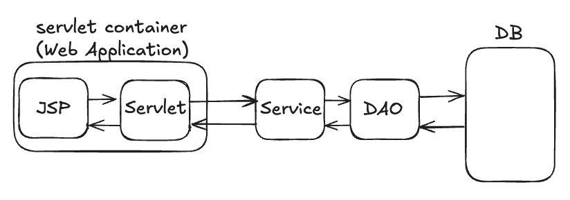
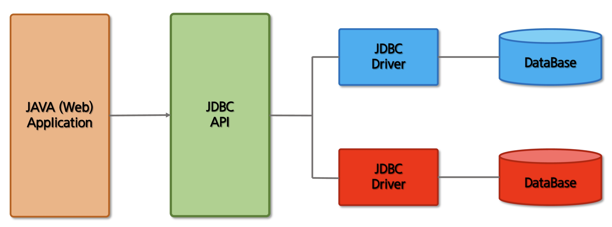
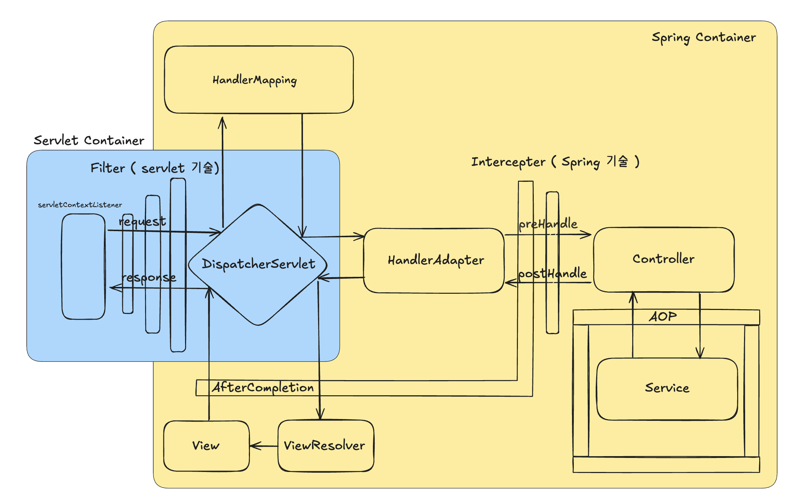

이 문서는 과거의 Java EE에서부터 현재 Spring Boot에 이르기까지의 발전 과정을 담고 있습니다. 과거의 코드와 개념들을 이해하고 넘어감으로써, 더 나은 코드 작성과 아키텍처 설계에 대한 통찰을 얻을 수 있습니다. 각 단계의 주요 기술과 도구들, 그리고 그것이 어떻게 현재의 코드와 시스템에 영향을 미치는지 소개합니다.

모든 노트는 [여기](https://secret-pyrite-78d.notion.site/18f82950fc9c4979b5a53a4bc15b32e7?v=62f5acc40e684af3bef27e709d042459)에서 확인할 수 있습니다.

---

## 목차

0. [Spring Legacy Project](#0-spring-legacy-project)  
   a. [Java EE와 Servlet](#a-java-ee와-servlet)  
   b. [JDBC](#b-jdbc)  
   c. [Cookie와 HttpSession](#c-cookie와-httpsession)  
   d. [Dependency Injection (DI)와 IoC](#d-dependency-injection-di와-ioc)  
   e. [AOP (Aspect Oriented Programming)](#e-aop-aspect-oriented-programming)  
   f. [Interceptor](#f-interceptor)  
   g. [MyBatis](#g-mybatis)  
1. [Spring 핵심 원리](#1-spring-핵심-원리)  
   a. [IoC와 DI](#a-ioc와-di)  
   b. [싱글톤 패턴과 빈 스코프](#b-싱글톤-패턴과-빈-스코프)  
   c. [DI 방식과 컴포넌트 스캔](#c-di-방식과-컴포넌트-스캔)  
2. [Spring MVC](#2-spring-mvc)  
3. [Spring MVC 2](#3-spring-mvc-2)  
4. [Spring MVC 3](#4-spring-mvc-3)  
5. [JPA for ORM](#5-jpa-for-orm)  
6. [Spring Boot와 JPA 활용](#6-spring-boot와-jpa-활용)  
7. [Spring Security](#7-spring-security)  
   a. [JWT](#a-jwt)  
   b. [JWT 다중 토큰 방식 (Access, Refresh)](#b-jwt-다중-토큰-방식-access-refresh)  
   c. [OAuth - Session](#c-oauth---session)
   
---

## 0. Spring Legacy Project  

이 프로젝트는 **Java EE** 기반에서 시작하여 **Spring Legacy**로 발전해온 과정을 보여줍니다. Java 기반의 엔터프라이즈 애플리케이션이 어떻게 Spring으로 이전되고, 현대적인 애플리케이션 아키텍처의 근간이 되었는지에 대한 배경을 이해하는 데 도움이 됩니다. 

### a. Java EE와 Servlet

Java EE는 Java 기반의 엔터프라이즈 애플리케이션 개발을 위한 표준이었으며, 특히 Servlet은 클라이언트와 서버 간의 동적 데이터 처리를 위한 핵심 기술로 사용되었습니다. `HttpServletRequest`와 `HttpServletResponse`를 사용하여 클라이언트의 요청을 처리하고, 필요한 데이터를 응답으로 제공하는 방식으로 동작했습니다. 이러한 아키텍처는 후에 Spring MVC 패턴의 기초가 되었습니다.

### b. JDBC

JDBC (Java Database Connectivity)는 자바와 데이터베이스 간의 연결을 위해 만들어진 API입니다. 다양한 DBMS에서 독립적으로 동작할 수 있도록 설계되었으며, `Connection`, `PreparedStatement`, `ResultSet` 등을 사용하여 SQL 쿼리를 실행하고 결과를 처리할 수 있습니다. 이는 나중에 더 높은 수준의 데이터 접근 기술인 MyBatis나 JPA로 발전하게 됩니다.

### c. Cookie와 HttpSession

HTTP 프로토콜은 무상태(stateless)로, 각 요청이 독립적으로 처리됩니다. 이를 보완하기 위해 Cookie와 HttpSession이 도입되었습니다. Cookie는 클라이언트 측에 저장된 데이터로, 사용자의 특정 정보를 기억할 수 있게 해주고, HttpSession은 서버 측에 저장된 데이터로 클라이언트의 상태를 유지하는 데에 사용되었습니다.

### d. Dependency Injection (DI)와 IoC

Dependency Injection (DI)와 IoC (Inversion of Control)는 객체 간의 결합도를 낮춰 유연한 구조를 제공하는 설계 원칙입니다. Spring Framework에서 DI를 사용하여 의존성 관리를 컨테이너에게 맡기며, XML, Java, Annotation을 통해 DI를 설정할 수 있습니다. 이는 애플리케이션의 복잡도가 증가하더라도 유연한 구조를 유지할 수 있게 합니다.

### e. AOP (Aspect Oriented Programming)

AOP (Aspect Oriented Programming)은 핵심 기능과 부가 기능을 분리하여 코드의 가독성과 재사용성을 높이는 방법입니다. 공통 관심사를 핵심 로직에서 분리하여 개발하고, 필요한 시점에 Aspect를 적용함으로써 특정 메서드에 공통 기능(Advice)을 적용할 수 있습니다.

### f. Interceptor

Interceptor는 Spring에서 특정 경로에 대한 요청을 가로채어 로그인 검사와 같은 공통 작업을 수행할 수 있도록 합니다. 필터와 유사하게 DispatcherServlet 전에 호출되며, 세션 체크 등의 작업을 처리할 수 있습니다.

### g. MyBatis

MyBatis는 SQL 기반의 데이터 접근 계층을 ORM의 형태로 매핑할 수 있게 하는 도구입니다. 자바 객체와 SQL 쿼리를 XML 파일로 매핑하며, 개발자가 쿼리를 직접 작성하면서도 데이터베이스와의 연동을 편리하게 해주는 프레임워크입니다.

---

## 1. Spring 핵심 원리  

**개요**  
스프링의 IoC(Inversion of Control)와 DI(Dependency Injection)를 기반으로 한 객체 지향 설계를 이해합니다. 이 섹션에서는 의존성 주입, 싱글톤 패턴, 컴포넌트 스캔, 자동 주입, 빈 생명주기 콜백, 빈 스코프 등의 개념을 다룹니다.

### a. IoC와 DI

IoC와 DI는 객체 간 결합도를 낮추어 유연성을 제공합니다. IoC는 애플리케이션 개발자가 객체의 생성과 생명주기를 직접 제어하지 않고, Spring Container가 대신 관리하도록 하여 객체 제어의 역전을 이룹니다.

### b. 싱글톤 패턴과 빈 스코프

Spring의 빈 관리 방식으로, 객체를 하나만 생성해 관리하는 **싱글톤 패턴**을 사용하며 빈의 생명주기를 관리합니다.

### c. DI 방식과 컴포넌트 스캔

**DI 방식**: 생성자 주입을 통해 모듈 간 결합도를 낮추고, 테스트 용이성을 높입니다. **컴포넌트 스캔**을 통해 어노테이션을 자동으로 탐색하고 빈을 등록합니다.

---

## 2. Spring MVC  

**개요**  
Spring MVC의 기본 원리와 동작 순서를 학습하여 웹 애플리케이션의 요청-응답 흐름을 이해합니다. DispatcherServlet의 역할, 서블릿을 이용한 데이터 전달 방식 및 컨트롤러와 뷰, 모델의 관계를 다룹니다.

**주요 학습 내용**
- **MVC 동작 순서**: DispatcherServlet, HandlerMapping, HandlerAdapter의 역할과 순서.
- **서블릿 설정**: `@WebServlet`과 `HttpServletRequest`, `HttpServletResponse`를 통해 백엔드와 프론트엔드의 통신을 처리.
- **HTTP 요청과 응답**: 클라이언트와 서버 간 데이터 전달 방식으로, `@RequestParam`과 `@ModelAttribute` 사용법.

**구성 파일**
- `HomeController.java`: 요청을 처리하고 뷰로 데이터를 전달하는 컨트롤러.
- `home.jsp`: 전달받은 데이터를 사용자에게 보여주는 뷰 템플릿.

---

## 3. Spring MVC 2  

**개요**  
Spring MVC의 고급 기능을 이해하며 예외 처리, 필터, 파일 업로드, 다형성을 활용한 HandlerAdapter 구성 등 실제 프로젝트에서 자주 쓰이는 기능을 구현합니다.

**주요 학습 내용**
- **인터셉터와 필터**: 요청 처리 전후 로직을 추가하여 요청 관리를 최적화.
- **파일 업로드**: `MultipartFile`을 활용한 파일 업로드 기능.
- **예외 처리**: 전역 예외 처리 설정으로 오류 발생 시 적절한 응답을 생성.

**구성 파일**
- `WebConfig.java`: 예외 처리, 인터셉터, 필터 설정을 위한 설정 파일.
- `FileUploadController.java`: 파일 업로드 요청을 처리하는 컨트롤러.

---

## 4. Spring MVC 3  

**개요**  
Spring MVC로 아이템 관리 시스템을 구현하여 CRUD 기능을 연습합니다. 이 과정에서 Spring Form 태그와 데이터 유효성 검증을 통해 사용자 입력을 관리합니다.

**주요 학습 내용**
- **CRUD 기능**: 아이템의 생성, 조회, 수정, 삭제 기능.
- **폼 데이터 처리**: Spring Form 태그를 사용한 입력 데이터 유효성 검증.
- **JPA와의 연동**: DB와 직접 연동하여 데이터를 조회하고 관리하는 방법.

**구성 파일**
- `ItemController.java`: CRUD 기능을 구현하는 컨트롤러.
- `item-form.jsp`, `item-list.jsp`: 아이템 관리 뷰 파일.

---

## 5. JPA for ORM  

**개요**  
JPA를 통해 객체와 관계형 데이터베이스를 매핑하는 기본 원리와 기술을 이해합니다. 이 과정에서 엔티티 매핑, 영속성 컨텍스트 관리, JPQL, 연관관계 매핑 등을 학습합니다.

**주요 학습 내용**
- **엔티티 매핑**: 객체와 테이블을 매핑하는 기본 설정.
- **JPQL 사용**: 데이터베이스 검색을 위한 쿼리 작성법.
- **연관관계 매핑**: 다대일, 일대다, 일대일, 다대다 관계 설정.

**구성 파일**
- `Member.java`, `Order.java`: 엔티티 클래스와 매핑 설정.
- `MemberRepository.java`: JPQL을 활용한 데이터 조회 메서드.

---

## 6. Spring Boot와 JPA 활용

**개요**  
Spring Boot와 JPA를 활용한 실전 프로젝트 예제로, 상거래 애플리케이션(jpashop)을 통해 스프링과 JPA의 연동을 학습합니다. API 개발 및 성능 최적화를 위해 다양한 관계 매핑과 JPA의 고급 기능을 활용합니다.

**주요 학습 내용**
- **Spring Boot 초기 설정**: 설정을 자동화하여 개발을 빠르게 시작.
- **JPA를 통한 데이터 관리**: 복잡한 비즈니스 로직을 구현하고 다양한 관계 매핑을 설정.
- **REST API 개발**: CRUD 기능을 API로 제공하며 클라이언트와의 상호작용 학습.

**구성 파일**
- `JpashopApplication.java`: Spring Boot 애플리케이션 진입점.
- `OrderService.java`, `MemberService.java`: 주요 비즈니스 로직을 처리하는 서비스 계층.
- `OrderController.java`, `MemberController.java`: API 요청을 처리하는 컨트롤러.

---

## 7. Spring Security  

### a. JWT
 
Spring Security와 JWT를 사용하여 로그인 인증 및 권한 부여를 수행합니다. 인증이 필요한 경로에 접근할 때, JWT를 검증하는 과정을 통해 사용자가 인증된 사용자임을 확인하고 요청을 처리합니다.

**JWT 인증 로직**
- **로그인 요청**: 사용자가 `/login` 경로로 `username`과 `password`를 전송하여 로그인 요청을 보냅니다.
- **인증 필터 작동**: `SecurityConfig` 설정에 따라 `LoginFilter`가 `UsernamePasswordAuthenticationFilter`를 대체하여 로그인 요청을 가로챕니다.
- **인증 토큰 생성 및 전달**: `LoginFilter`의 `attemptAuthentication` 메서드에서 사용자 정보를 기반으로 `UsernamePasswordAuthenticationToken`을 생성하고 `AuthenticationManager`에 전달하여 인증을 수행합니다.
- **사용자 정보 확인**: `AuthenticationManager`는 `CustomUserDetailsService`를 통해 데이터베이스에서 사용자를 조회하여 인증합니다.
- **JWT 생성 및 응답**: 인증 성공 시 `JWTUtil`을 사용해 JWT를 생성하고 `Authorization` 헤더에 포함하여 클라이언트에 전달합니다.
- **인증 실패 처리**: 인증 실패 시 `unsuccessfulAuthentication` 메서드가 호출되며, HTTP 상태 코드 `401`을 반환하여 클라이언트에 실패를 알립니다.

**JWT 검증 필터**

**JWTFilter**는 각 요청에서 JWT의 유효성을 검증하여, 인증된 요청인지 확인합니다.
- **JWTFilter 생성**: `OncePerRequestFilter`를 상속받아 매 요청마다 `doFilterInternal` 메서드를 호출하여 JWT 검증을 수행합니다.
- **JWT 토큰 추출 및 유효성 검사**: `Authorization` 헤더에서 JWT를 추출하고 `JWTUtil`을 통해 토큰 만료 여부를 확인합니다.
- **임시 인증 정보 설정**: 유효한 JWT의 경우, `username`과 `role` 정보를 추출하여 `SecurityContextHolder`에 임시로 인증 정보를 등록합니다.
- **필터 체인 진행**: 검증이 완료되면 `filterChain.doFilter(request, response)`를 호출하여 다음 필터로 요청을 전달합니다.
- **SecurityConfig에서 JWTFilter 등록**: `SecurityConfig`에서 `JWTFilter`를 `LoginFilter` 앞에 등록하여, 모든 요청에 대해 JWT 검증을 수행하도록 설정합니다.
- **세션 관리**: 요청 상태가 유지되지 않도록 세션을 `STATELESS`로 설정합니다.

### b. JWT 다중 토큰 방식 (Access, Refresh)
1. **다중(Refresh/Access) 토큰 발급**
   
    로그인할때 사용하는 LoginFilter에서 Access/Refresh 토큰을 분리하여 **보안성을 높이고, 사용자 경험을 개선**합니다. 짧은 유효 기간을 가진 Access 토큰은 자주 사용되는 요청에 사용되고, Refresh 토큰은 더 긴 유효 기간을 가지고 필요할 때만 사용되어 탈취 위험을 줄입니다.
    - **클래스**: `LoginFilter`
    - **메서드**: `successfulAuthentication`
    - **변경 사항**:
        - 로그인 성공 시 **Access**와 **Refresh** 두 종류의 JWT 토큰을 발급하도록 변경했습니다.
        - `jwtUtil.createJwt` 메서드를 통해 각각 유효 기간이 다른 두 개의 토큰을 생성합니다.
        - Access 토큰은 응답 헤더에 추가하고, Refresh 토큰은 `createCookie` 메서드로 쿠키에 저장하여 클라이언트에 전달합니다.
    - **결과**: Access 토큰은 **로컬 스토리지**에, Refresh 토큰은 **쿠키**에 저장되어 이후 인증 요청에서 재사용됩니다.
2. **Access 토큰 필터 (로그인)**
   
    
    
    로그인후, 헤더에 담긴 Access 토큰을 확인하는 JWTFilter에서 Access 토큰을 확인합니다.
    
    - **클래스**: `JWTFilter`
    - **메서드**: `doFilterInternal`
    - **변경 사항**:
        - `request.getHeader("access")`로 요청 헤더에서 Access 토큰을 가져와 검증합니다.
        - 토큰이 없거나 만료되었을 경우 상태 코드와 메시지를 응답으로 반환하여 인증 실패를 처리합니다.
        - 유효한 Access 토큰일 경우, 토큰에 포함된 사용자 정보를 추출해 **SecurityContext**에 인증 정보를 설정합니다.
    - **결과**: 모든 요청에서 Access 토큰을 검증하며, 만료된 토큰은 401 응답을 반환합니다.
4. **Refresh로 Access 재발급 (reissue)**
   
    
   
    Access 토큰이 만료되었을때 Refresh 토큰으로 Access 토큰 재발급하는 로직
    
    - **클래스**: `ReissueService`
    - **메서드**: `reissueAccessToken`
    - **변경 사항**:
        - 쿠키에서 Refresh 토큰을 가져와 유효성을 확인한 후 새로운 Access 토큰을 재발급합니다.
        - Refresh 토큰이 만료되지 않았다면 새로운 Access 토큰을 생성하고, 응답 헤더에 추가합니다.
    - **결과**: Access 토큰이 만료된 상태에서 요청 시, 클라이언트는 Refresh 토큰으로 새로운 Access 토큰을 요청해 재발급받을 수 있습니다.
6. **Refresh Rotate (Refresh 토큰 갱신)**
    
    Refresh 토큰 탈취를 방지하기 위해, 매번 재발급 시 새로운 Refresh 토큰을 생성합니다. 이는 **Refresh 토큰을 악의적으로 재사용하려는 시도를 차단**합니다.
    
    - **클래스**: `ReissueService`
    - **메서드**: `reissueAccessToken`
    - **변경 사항**:
        - Refresh 토큰을 사용해 Access 토큰을 재발급할 때, 기존 Refresh 토큰을 무효화하고 새 Refresh 토큰을 발급합니다.
        - 새로 발급된 Refresh 토큰은 쿠키에 다시 저장됩니다.
    - **결과**: Refresh 토큰을 주기적으로 갱신하여, 탈취된 토큰의 오용을 방지하고 보안성을 높입니다.
7. **Refresh 토큰 서버측 저장**
    
    Refresh 토큰의 탈취 및 오용 방지를 위해 서버에 Refresh 토큰을 저장해 **서버가 모든 인증의 주도권을 가질 수 있게** 합니다. 이렇게 하면 만료 시 블랙리스트에 등록하거나, 로그아웃 시 삭제할 수 있습니다.
    
    - **클래스**: `LoginFilter`, `ReissueService`
    - **메서드**: `successfulAuthentication`, `addRefreshEntity`, `deleteByRefresh`
    - **변경 사항**:
        - 로그인 시 발급된 Refresh 토큰을 데이터베이스에 저장하고, 토큰 재발급 시 이전 토큰을 삭제하고 새로 저장합니다.
        - `RefreshRepository`를 통해 Refresh 토큰이 서버측에 저장되고, 기존 토큰은 삭제됩니다.
    - **결과**: 서버에서 관리되는 Refresh 토큰만 유효하며, 탈취된 토큰이 재사용되지 않도록 합니다.
8. **로그아웃**
    
    클라이언트가 로그아웃 요청 시, 서버에서 Refresh 토큰을 무효화하여 **탈취된 Refresh 토큰이 재사용되는 것을 방지**합니다.
    
    - **클래스**: `CustomLogoutFilter`
    - **메서드**: `doFilter`
    - **변경 사항**:
        - `/logout` 경로의 POST 요청을 통해 Refresh 토큰을 서버에서 삭제하고, 쿠키를 초기화하여 클라이언트에서 사용하지 못하도록 합니다.
        - 쿠키에서 Refresh 토큰을 가져와 서버에 저장된 토큰과 비교 후 삭제합니다.
    - **결과**: 로그아웃 시 Refresh 토큰이 무효화되며, 이후 요청에서 토큰 재발급이 불가능해집니다.
### c. OAuth - Session

**JWT 인증 로직**
1. 클라이언트가 소셜 로그인을 시도한다. → 백엔드로 소셜 로그인 GET 요청이 넘어온다.
2. 백엔드의 `OAuth2AuthorizationRequestRedirectFilter`에서 로그인 요청을 받아서 소셜 로그인 인증 서버에 요청을 보낸다.
3. 2번의 요청에 대해서 우리쪽으로 로그인 페이지를 응답한다. 사용자는 여기서 로그인을 진행한다.
4. 로그인이 성공하면 우리가 등록한 redirect-URI를 통해 access 토큰을 발급하기 위한 코드를 보낸다.
5. 백엔드는 redirect_URI로 데이터를 받는다 .
6. redirect_URI 주소는 `OAuth2LoginAuthenticatioinFilter`에서 가로채고 
7. `OAuth2LoginAuthenticationProvider`에서 code로 인증 서버에 방문해서 Access토큰을 발급받는다.
8. Access토큰으로 리소스 서버에 접근해서 유저 정보를 획득한다.  
9. 8번에서 OAuthService를 호출해서 유저 정보를 획득하고 OAuth2User에 담아서 유저 정보를 반환받는다.
10. 로그인이 성공하면 로그인 성공 핸들러가 동작하게 되고 이때 JWT를 발급 후 유저한테 보낸다.

**구현**
1. application.properties 변수 설정 :  변수 설정만 진행하면 OAuth2AuthorizationRequestRedirectFilter → OAuth2LoginAuthenticationFilter → OAuth2LoginAuthenticationProvider 까지의 과정을 추가 설정하지 않아도 자동으로 진행한다.
2. OAuth2UserService : 소셜 로그인을 완료한후 사용자의 데이터를 받기 위한 부분이다. OAuth2UserService를 통해 구현한다.
3. OAuth2UserDetails : 이 클래스는 Spring Security에서 인증된 사용자 객체로 사용되며, 인증이 완료된 후 사용자 정보를 SecurityContext에 저장하여 애플리케이션 내에서 인증된 사용자의 정보를 참조할 수 있게 해준다.

OAuthJWT
