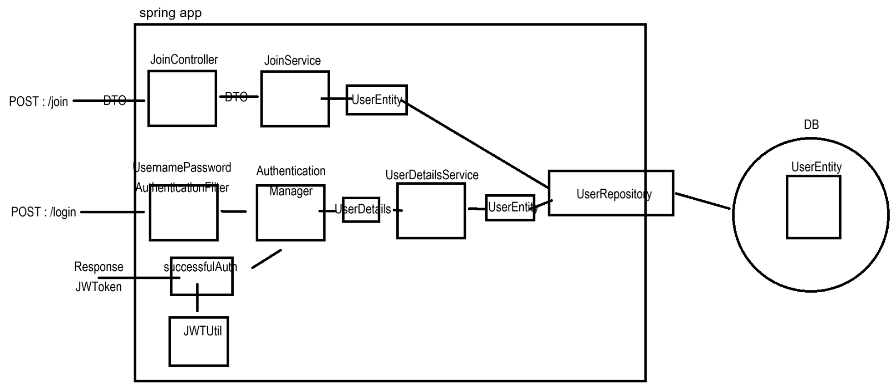
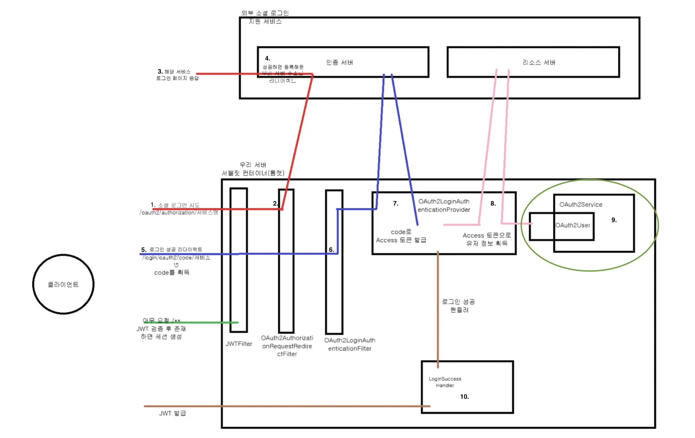

# 1. 팀 아이디어 
팀 회의를 진행하면서 제가 생각한 아이디어를 작성했습니다.
## 1.1 학부모 민원상담 플랫폼
### 1.1.1 배경 
최근 한국에서는 학부모의 민원으로 인해 교사들의 업무가 과중해지는 문제가 제기되고 있습니다. 이를 해결하기 위한 방안으로, 교사가 공개할 정보와 비공개 정보를 명확하게 분류하여 데이터베이스에 저장하고, 학부모가 필요할 때 채팅이나 음성 문의를 통해 정보를 요청하면 해당 데이터베이스를 바탕으로 AI가 자동으로 응답하는 시스템을 제안합니다.

특히, 특정 학생의 정보는 해당 학생의 학부모만 열람할 수 있도록 권한을 제한함으로써 개인정보 보호를 강화할 수 있습니다. 이 시스템은 교사의 민원 대응 시간을 줄이고, 교사가 학생 교육에 보다 집중할 수 있도록 돕는 것을 목표로 합니다.
### 1.1.2 인터뷰 내용
최근 한국에서는 학부모의 민원으로 인해 교사들의 업무가 과중해지는 문제가 제기되고 있습니다. 이를 해결하기 위한 방안으로, 교사가 공개할 정보와 비공개 정보를 명확하게 분류하여 데이터베이스에 저장하고, 학부모가 필요할 때 채팅이나 음성 문의를 통해 정보를 요청하면 해당 데이터베이스를 바탕으로 AI가 자동으로 응답하는 시스템을 제안합니다.

특히, 특정 학생의 정보는 해당 학생의 학부모만 열람할 수 있도록 권한을 제한함으로써 개인정보 보호를 강화할 수 있습니다. 이 시스템은 교사의 민원 대응 시간을 줄이고, 교사가 학생 교육에 보다 집중할 수 있도록 돕는 것을 목표로 합니다.
### 1.1.3 주기능
## 선생님이 보는 페이지

### 기능 1 : 데이터 저장

1. 다양한 사항의 데이터를 저장한다. 
    1. 학교 시설 관련
    2. 자녀 학업 관련
    3. 교우 관계 관련
    4. 학교 수업 관련
    5. 학교 및 학급 행사
    6. 학사 일정 관련
2. 이 데이터들은 (공개), (비공개), (특정 학부모 대상 공개)로 나눈다.

### 기능 2 : 민원 처리

1. 해당 반의 학부모가 보냈었던 민원들을 볼 수 있다.
2. 전국적으로 기록됐던 민원들을 볼 수 있게 하여 선생님이 참고할 수 있도록 한다.
3. 민원을 확인할 때 “AI 요약 내용” 제공

### 학부모가 보는 페이지

1. 챗봇 자동응답  : 내일 소풍 일정 등 **답변이 정해져 있는 질문**의 경우 챗봇 자동응답 기능으로 넣는다. 
2. 고민 상담 등 선생님의 답변이 필요한 경우 선생님이 기록했던 내용을 기반으로 대답한다. 
    1. 해당 문의사항에 대한 데이터가없는 경우 : 해당 데이터가 없습니다.
    2. 열람 권한이 없는 경우 : ~~사항으로 권한이 없습니다.
    3. 나머지 경우 : ai기반 대답
3. 더 자세한 대답이 경우 : 선생님한테 직접 물어보세요!
    1. 학부모가 글을 길게 쓸때 줄여주고 제목을 붙여준다.
    2. 생성형 AI 기반 대답하고, 선생님이 미리보기 기능 제공 후 고칠거 있으면 고치고 학부모한테 넘기기.
### 1.1.4 flow
### 플로우1 : 선생님 → 학부모

선생님

1. 웹사이트에서 다양한 사항의 데이터를 저장한다. 이 데이터들은 (공개), (비공개), (특정 학부모 대상 공개)로 나뉘어져 있다.
    1. 학교 시설 관련
    2. 학교 수업 관련
    3. 학교 및 학급 행사
    4. 학사 일정 관련
    5. 자녀 학업 관련
    6. 교우 관계 관련
2. 학부모가 문의사항을 넣으면 해당 데이터에 맞는 대답을 해준다.
    1. 해당 문의사항에 대한 데이터가없는 경우 : 해당 데이터가 없습니다.
    2. 열람 권한이 없는 경우 : ~~사항으로 연람이 안됩니다

학부모

1. 학부모는 앱 & 카카오 플러스를 통해 문의사항을 넣는다.
2. 생성형 ai를 통한 대답을 얻는다.
3. 부족하면 선생님의 연락처로 이동한다.

### 플로우 2 : 학부모 → 선생님

1. 학부모 입장에서 건의 사항을 넣을 수 있도록 해야한다.
    1. 예를들어 우리 애가 편식을해요. 어떻게 할까요? 이런 문제를 교사한테 연결시키도록 하자.
2. 선생님은 해당 답변에 대한 적절한 대답을 저장된 데이터들을 참고하며 수월하게 대답할 수 있도록 한다.

## 1.2 깃 연동 노트 작성 플랫폼
- 깃 커밋 내용을 보고 일기장 작성., 노트 작성.
- 노션 api를 활용하여 기존의 노션 노트 내용을 보고 필요한 내용을 노션에 자동으로 노트 추가 기능
- 팀 별로 페이지 생성
    - 팀원 끼리 공유 가능 ( 보고 기능 )
    - rtc 기능으로 팀 일기 노트 가능.
# 2. 기타 기여 사항
1. 프로젝트에 필요한 매칭 알고리즘 구현
2. 백엔드 설계 - 진행중
3. 다양한 아이디어 제시

# 3. 개인 공부 -  Spring Security  
개인적으로 공부한 내용을 업로드 했씁니다.

### a. JWT
 
Spring Security와 JWT를 사용하여 로그인 인증 및 권한 부여를 수행합니다. 인증이 필요한 경로에 접근할 때, JWT를 검증하는 과정을 통해 사용자가 인증된 사용자임을 확인하고 요청을 처리합니다.

**JWT 인증 로직**
- **로그인 요청**: 사용자가 `/login` 경로로 `username`과 `password`를 전송하여 로그인 요청을 보냅니다.
- **인증 필터 작동**: `SecurityConfig` 설정에 따라 `LoginFilter`가 `UsernamePasswordAuthenticationFilter`를 대체하여 로그인 요청을 가로챕니다.
- **인증 토큰 생성 및 전달**: `LoginFilter`의 `attemptAuthentication` 메서드에서 사용자 정보를 기반으로 `UsernamePasswordAuthenticationToken`을 생성하고 `AuthenticationManager`에 전달하여 인증을 수행합니다.
- **사용자 정보 확인**: `AuthenticationManager`는 `CustomUserDetailsService`를 통해 데이터베이스에서 사용자를 조회하여 인증합니다.
- **JWT 생성 및 응답**: 인증 성공 시 `JWTUtil`을 사용해 JWT를 생성하고 `Authorization` 헤더에 포함하여 클라이언트에 전달합니다.
- **인증 실패 처리**: 인증 실패 시 `unsuccessfulAuthentication` 메서드가 호출되며, HTTP 상태 코드 `401`을 반환하여 클라이언트에 실패를 알립니다.

**JWT 검증 필터**

**JWTFilter**는 각 요청에서 JWT의 유효성을 검증하여, 인증된 요청인지 확인합니다.
- **JWTFilter 생성**: `OncePerRequestFilter`를 상속받아 매 요청마다 `doFilterInternal` 메서드를 호출하여 JWT 검증을 수행합니다.
- **JWT 토큰 추출 및 유효성 검사**: `Authorization` 헤더에서 JWT를 추출하고 `JWTUtil`을 통해 토큰 만료 여부를 확인합니다.
- **임시 인증 정보 설정**: 유효한 JWT의 경우, `username`과 `role` 정보를 추출하여 `SecurityContextHolder`에 임시로 인증 정보를 등록합니다.
- **필터 체인 진행**: 검증이 완료되면 `filterChain.doFilter(request, response)`를 호출하여 다음 필터로 요청을 전달합니다.
- **SecurityConfig에서 JWTFilter 등록**: `SecurityConfig`에서 `JWTFilter`를 `LoginFilter` 앞에 등록하여, 모든 요청에 대해 JWT 검증을 수행하도록 설정합니다.
- **세션 관리**: 요청 상태가 유지되지 않도록 세션을 `STATELESS`로 설정합니다.

### b. JWT 다중 토큰 방식 (Access, Refresh)
1. **다중(Refresh/Access) 토큰 발급**
   
    로그인할때 사용하는 LoginFilter에서 Access/Refresh 토큰을 분리하여 **보안성을 높이고, 사용자 경험을 개선**합니다. 짧은 유효 기간을 가진 Access 토큰은 자주 사용되는 요청에 사용되고, Refresh 토큰은 더 긴 유효 기간을 가지고 필요할 때만 사용되어 탈취 위험을 줄입니다.
    - **클래스**: `LoginFilter`
    - **메서드**: `successfulAuthentication`
    - **변경 사항**:
        - 로그인 성공 시 **Access**와 **Refresh** 두 종류의 JWT 토큰을 발급하도록 변경했습니다.
        - `jwtUtil.createJwt` 메서드를 통해 각각 유효 기간이 다른 두 개의 토큰을 생성합니다.
        - Access 토큰은 응답 헤더에 추가하고, Refresh 토큰은 `createCookie` 메서드로 쿠키에 저장하여 클라이언트에 전달합니다.
    - **결과**: Access 토큰은 **로컬 스토리지**에, Refresh 토큰은 **쿠키**에 저장되어 이후 인증 요청에서 재사용됩니다.
2. **Access 토큰 필터 (로그인)**
   
    
    
    로그인후, 헤더에 담긴 Access 토큰을 확인하는 JWTFilter에서 Access 토큰을 확인합니다.
    
    - **클래스**: `JWTFilter`
    - **메서드**: `doFilterInternal`
    - **변경 사항**:
        - `request.getHeader("access")`로 요청 헤더에서 Access 토큰을 가져와 검증합니다.
        - 토큰이 없거나 만료되었을 경우 상태 코드와 메시지를 응답으로 반환하여 인증 실패를 처리합니다.
        - 유효한 Access 토큰일 경우, 토큰에 포함된 사용자 정보를 추출해 **SecurityContext**에 인증 정보를 설정합니다.
    - **결과**: 모든 요청에서 Access 토큰을 검증하며, 만료된 토큰은 401 응답을 반환합니다.
4. **Refresh로 Access 재발급 (reissue)**
   
    
   
    Access 토큰이 만료되었을때 Refresh 토큰으로 Access 토큰 재발급하는 로직
    
    - **클래스**: `ReissueService`
    - **메서드**: `reissueAccessToken`
    - **변경 사항**:
        - 쿠키에서 Refresh 토큰을 가져와 유효성을 확인한 후 새로운 Access 토큰을 재발급합니다.
        - Refresh 토큰이 만료되지 않았다면 새로운 Access 토큰을 생성하고, 응답 헤더에 추가합니다.
    - **결과**: Access 토큰이 만료된 상태에서 요청 시, 클라이언트는 Refresh 토큰으로 새로운 Access 토큰을 요청해 재발급받을 수 있습니다.
6. **Refresh Rotate (Refresh 토큰 갱신)**
    
    Refresh 토큰 탈취를 방지하기 위해, 매번 재발급 시 새로운 Refresh 토큰을 생성합니다. 이는 **Refresh 토큰을 악의적으로 재사용하려는 시도를 차단**합니다.
    
    - **클래스**: `ReissueService`
    - **메서드**: `reissueAccessToken`
    - **변경 사항**:
        - Refresh 토큰을 사용해 Access 토큰을 재발급할 때, 기존 Refresh 토큰을 무효화하고 새 Refresh 토큰을 발급합니다.
        - 새로 발급된 Refresh 토큰은 쿠키에 다시 저장됩니다.
    - **결과**: Refresh 토큰을 주기적으로 갱신하여, 탈취된 토큰의 오용을 방지하고 보안성을 높입니다.
7. **Refresh 토큰 서버측 저장**
    
    Refresh 토큰의 탈취 및 오용 방지를 위해 서버에 Refresh 토큰을 저장해 **서버가 모든 인증의 주도권을 가질 수 있게** 합니다. 이렇게 하면 만료 시 블랙리스트에 등록하거나, 로그아웃 시 삭제할 수 있습니다.
    
    - **클래스**: `LoginFilter`, `ReissueService`
    - **메서드**: `successfulAuthentication`, `addRefreshEntity`, `deleteByRefresh`
    - **변경 사항**:
        - 로그인 시 발급된 Refresh 토큰을 데이터베이스에 저장하고, 토큰 재발급 시 이전 토큰을 삭제하고 새로 저장합니다.
        - `RefreshRepository`를 통해 Refresh 토큰이 서버측에 저장되고, 기존 토큰은 삭제됩니다.
    - **결과**: 서버에서 관리되는 Refresh 토큰만 유효하며, 탈취된 토큰이 재사용되지 않도록 합니다.
8. **로그아웃**
    
    클라이언트가 로그아웃 요청 시, 서버에서 Refresh 토큰을 무효화하여 **탈취된 Refresh 토큰이 재사용되는 것을 방지**합니다.
    
    - **클래스**: `CustomLogoutFilter`
    - **메서드**: `doFilter`
    - **변경 사항**:
        - `/logout` 경로의 POST 요청을 통해 Refresh 토큰을 서버에서 삭제하고, 쿠키를 초기화하여 클라이언트에서 사용하지 못하도록 합니다.
        - 쿠키에서 Refresh 토큰을 가져와 서버에 저장된 토큰과 비교 후 삭제합니다.
    - **결과**: 로그아웃 시 Refresh 토큰이 무효화되며, 이후 요청에서 토큰 재발급이 불가능해집니다.
### c. OAuth - Session

**JWT 인증 로직**
1. 클라이언트가 소셜 로그인을 시도한다. → 백엔드로 소셜 로그인 GET 요청이 넘어온다.
2. 백엔드의 `OAuth2AuthorizationRequestRedirectFilter`에서 로그인 요청을 받아서 소셜 로그인 인증 서버에 요청을 보낸다.
3. 2번의 요청에 대해서 우리쪽으로 로그인 페이지를 응답한다. 사용자는 여기서 로그인을 진행한다.
4. 로그인이 성공하면 우리가 등록한 redirect-URI를 통해 access 토큰을 발급하기 위한 코드를 보낸다.
5. 백엔드는 redirect_URI로 데이터를 받는다 .
6. redirect_URI 주소는 `OAuth2LoginAuthenticatioinFilter`에서 가로채고 
7. `OAuth2LoginAuthenticationProvider`에서 code로 인증 서버에 방문해서 Access토큰을 발급받는다.
8. Access토큰으로 리소스 서버에 접근해서 유저 정보를 획득한다.  
9. 8번에서 OAuthService를 호출해서 유저 정보를 획득하고 OAuth2User에 담아서 유저 정보를 반환받는다.
10. 로그인이 성공하면 로그인 성공 핸들러가 동작하게 되고 이때 JWT를 발급 후 유저한테 보낸다.

**구현**
1. application.properties 변수 설정 :  변수 설정만 진행하면 OAuth2AuthorizationRequestRedirectFilter → OAuth2LoginAuthenticationFilter → OAuth2LoginAuthenticationProvider 까지의 과정을 추가 설정하지 않아도 자동으로 진행한다.
2. OAuth2UserService : 소셜 로그인을 완료한후 사용자의 데이터를 받기 위한 부분이다. OAuth2UserService를 통해 구현한다.
3. OAuth2UserDetails : 이 클래스는 Spring Security에서 인증된 사용자 객체로 사용되며, 인증이 완료된 후 사용자 정보를 SecurityContext에 저장하여 애플리케이션 내에서 인증된 사용자의 정보를 참조할 수 있게 해준다.

OAuthJWT
